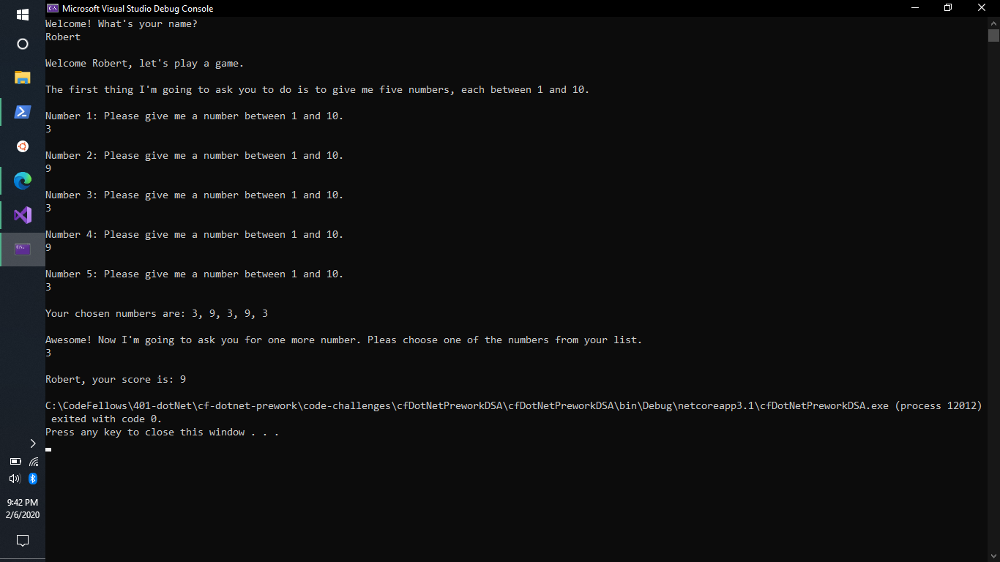
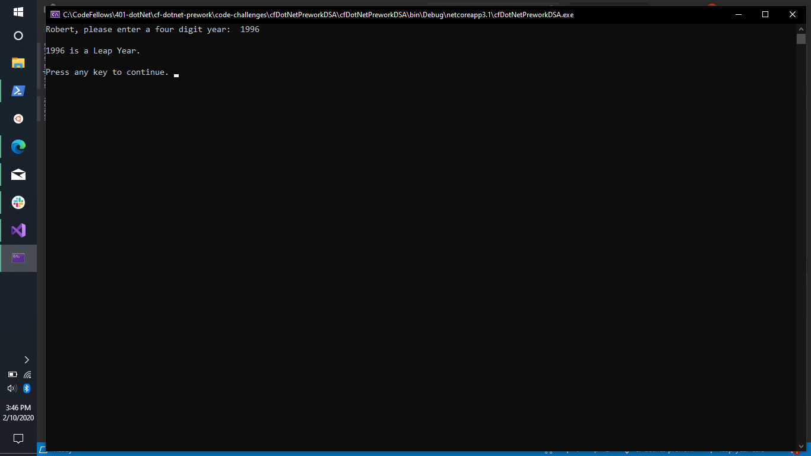

# cf-dotnet-prework
Code Fellows .NET 401 - Prework Assignments  
**Author**: [Robert James Nielsen](https://github.com/robertjnielsen/)  

## Overview

This repository contains my completed prework assignments for the 401 .NET course at Code Fellows.

## Table Of Contents

1. **[Mindset](https://github.com/robertjnielsen/cf-dotnet-prework/blob/master/mindset.md)**
2. **[Readings](https://github.com/robertjnielsen/cf-dotnet-prework/blob/master/readings.md)**

## Code Challenges

### Problem One: Array Max Result

**Problem Domain**: Create a console application that prompts the user to input five numbers between 1 and 10, and store those numbers in an array. Display that array to the user, and prompt them for one of the numbers from the array. Their selected number will then be _"scored"_ based on the frequency (number of times) that the number is included in the array. That score will then be displayed to the user.

### Problem Two: Leap Year Calculator

**Problem Domain**: Create a console application that given a year, determines if that year is a leap year or not.

